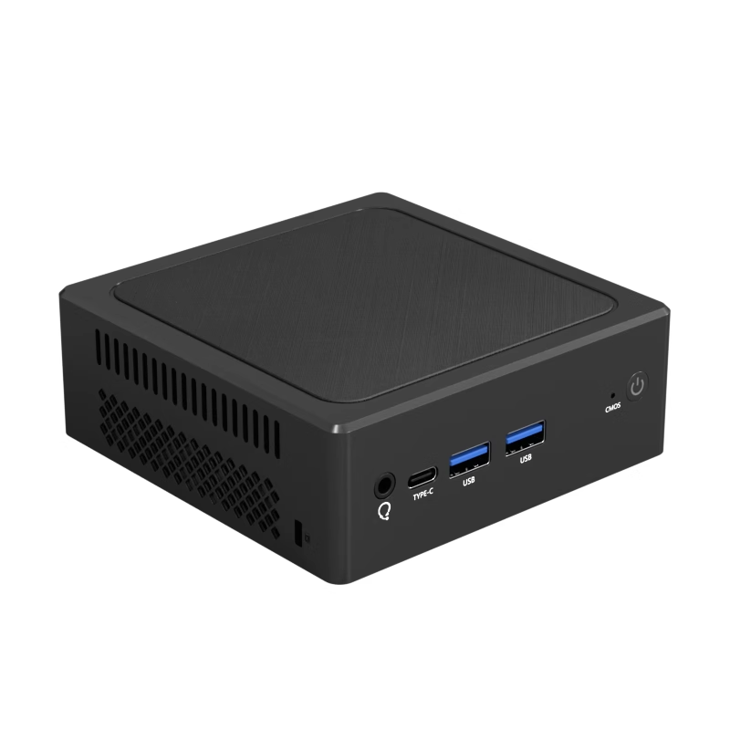

# 机械电控联合培训
前言：除了电控组，机械组也要知道这些基础知识，因为某些装置的原理作用注意点对机械组的设计和装配也会有影响  
  
## 主控板
  
机器人的核心，所有程序在里面运行，通过它协调控制传感器和气缸电机等部件  
## 接头
1.XH2.54   
  
2.GH1.25  
  
3.XT60\XT30  
  
4.MR60\MR30  
  
5.牛角座和排线  
  
## 编码器
### 分类1
1.相对式编码器  
原理：脉冲计数  
特点：每次上电角度都从零开始，掉电丢失  
  
2.单圈绝对式编码器  
特点：每次上电读取的角度是绝对式的，掉电不丢失  
  
3.多圈绝对式编码器  
原理：特殊光栅编码  
特点：体积大，安装不方便，支持转速低，价格昂贵  
 
### 分类2
1.光电式编码器  
原理：光栅计数  
优点：精准不飘值  
缺点：价格贵,体积大,安装不方便  
  
  
2.磁编码器   
原理：检测磁场   
优点：价格便宜，安装方便  
缺点：电机端需要加磁铁  
注：磁铁需要买径向磁铁  
实验室常用型号: AS5047P  
  
## 电机  
  
注意：无刷电机内部是线圈和永磁体, 通过线圈变身电磁铁产生磁场吸引永磁体控制电机运动  
电机内阻很小, 在mΩ级别, 用万用表测量三相线是导通的, 可以用这个方式辨别电机好坏  
在运动过程中磁铁切割线圈产生反电动势会抵消电压, 所以电机中电流不会太大, 然而当负载过重时, 电机速度会降低甚至停下, 这时候没有反电动势抵消电压, 电机电流就会很大, 会严重发热  
当电机完全停下时, 反电动势完全消失, 整个电机可以视作一个电阻丝, 所有热量用来发热, 我们称这种情况为堵转, 电机高负载运行或者堵转时, 电机热量累积, 时间长后很容易导致永磁体消磁和线圈烧毁    
在使用中, 负载过大电机带不动, 电流模式给的电流太小, 参数不对导致电机无法启动, 以及电机制动时, 都会有电机堵转的情况  
我们在使用中, 应尽量减少出现堵转的情况, 减少堵转频率和堵转时间, 增加良好的散热，关注其温度防止过热烧电机  
电机使用中要注意电流和电压限制, 超过最大电流和电压也会导致发热严重  
电机在过流到一定程度时会出现磁饱和效应，扭矩达到上限，再增大电流对其提升微弱；电机内部有电感，电流突变时（突然启动，急加减速或者急刹车）会产生反向电压，非电池供电时可能会损坏，电池供电时反向电压会使电压升高  
对电压有要求的场景需要考虑电机的反向电压  
一些方波控制的无刷电机不能带载启动，一些内阻比较大的电机不能使用  
电机在速度非常低时很难低速启动，电机极对数越大可以转的最低速度就越大  
  
1.三相航模无刷电机  
  
辨别: 有裸露三相线
优点：可选型号宽，种类型号多，功率上限高，价格相对关节电机便宜  
缺点：需要搭配电机驱动板和外接编码器  
注意：电机三相线的顺序只决定电机转的方向，可软件调整，无需在意；电机装车前一定要刷好参数保存，不然要拆了重新装，编码器刷好后不要修改编码器和电机定子的相对位置，不要修改磁铁和电机转子的相对位置  
参数：电机的扭矩和电流有关，转速和电压有关；电机的KV值代表每升高1V电压提升的转速；电机最好不要过流，过流也不要超过10%；  
  
2.关节电机(相当于集成式无刷电机)  
  
辨别: 无裸露三相线  
优点：内置编码器，使用简单，位控更精准, 最低速度相对较高  
缺点：种类型号少，价格昂贵  
  
3.舵机  
优点：便宜小巧  
缺点：一般都是pwm控制，不支持组网，一个舵机陪三根线，接线困难；转速慢，相应慢；不支持360°多圈旋转；不能返回数据，不支持闭环控制   
  
电机种类选型: 队长讲  
  
## 电机驱动板
  
原理：逆变器  
实验室常用的电机驱动板是VESC，常用的店家是创客基地，翻天科技和永刚驱动主店。
创客基地最便宜，但是几乎没有售后，出了问题无人解答，客服不理人，而且很难用，维修要花很多钱；永刚驱动主店的价格最贵，但是维修只收原料费和快递费，服务态度好，耐心解答问题  
电机驱动板主要是用来驱动无刷航模电机，需要接三相线和编码器，然后通过CAN总线和主控板通信；电机驱动板购买考虑的主要参数是最大电流和电压
## 迷你主机
  
算力比主控强大的多, 用来解析摄像头和雷达的数据, 以及跑AI模型  
## 传感器
1.DT35  
原理：激光测距  
优点：精准，采样频率高  
缺点：距离只支持八米，需要有墙做定位，对墙的高度有要求，对水平装配和场地的平整度有要求，不能被挡住  
  
2.陀螺仪  
原理：加速度累计  
优点：精度高（相对于3D雷达），应用场景不可替代  
缺点：贵  
注意：会受振动影响，装配要在下面垫海绵  
  
3.3D雷达  
原理：  
优点：某些场景无法替代，机器人离地不受影响  
缺点：需要小电脑，耗电，反馈频率低，非常贵，有时候需要摆车架确认初始位置  
  
4.码盘  
原理：正交轮子，通过光栅编码器读累计值计算xy坐标    
优点：精度高，反馈速率高   
缺点：机器人离地后需要重新校准；必须位于底盘上，占用位置大；在无其他校准方式前必须摆车确认初始位置    
  
5.相机  
优点：能AI识别物体，颜色，测距，功能多  
缺点：算力要求高，需要小电脑，反馈频率是最低的，相机越多频率越低  
注意；一辆车上最好不要有太多相机（反面教材24年车5个相机） 
  
6.色标传感器  
优点：识别颜色，速度远大于相机  
缺点；实验室没有使用经验  
  
7.光电开关，限位开关，光电门  
光电开关和光电门检测光线有没有被挡住，限位开关检测它有没有被撞到，可以用来检测物体位置  
## 布线
无论是信号线还是电源线对线电阻都有要求  
电源线要承受大电流，需要根据电流范围选择合适粗细的电源线  
信号线要进行阻抗匹配，而且信号线电压低（一般3.3~5V），太长的信号线会导致能量衰减通信出现错误  
之前出现过并联三个spi线未做阻抗匹配无法通信，CAN线需要60~120Ω电阻，需要时刻维持  
线路焊接触电电阻会大，发热会加剧，还有有信号反射，而且焊接处强度会降低容易断，一根线上通常不要超过两个焊点  
信号线之间也会有电磁干扰  
高中物理：变换的电流会产生变换的磁场，变换的磁场会产生变换的电流，信号线通常都是快速传递信息的，对于一些高频线（如相机上的USB 3.2）就会对临近的信号线产生干扰，这时需要加屏蔽胶带处理  
信号线绕线也会有类似干扰，所以布线禁止绕线，长度不合适就拆了重焊，不要嫌麻烦，CAN和485需要双绞线  
## 电池
  
  
电池的放电倍率（C）*电池容量（A·h）= 电池最大瞬时电流（A）  
电池瞬间放电会导致电压下降，对电压有要求的场景慎用（电机占空比模式）  
布线时注意计算线路中最大电流，保证电池能正常供电，否则会损坏电池  
24V电池电压使用中不要低于22.2V，12V电池使用中不要低于11.1V，建议24V就去充电  
注意：锂电池没有均衡板情况下不要并联；18650好21700之类的电池在测量尺寸时千万不要直接拿金属卡尺量，此电池正负极离得很近，测量时极易短路引起爆炸
## 无线通讯
无线通讯发送接收装置属于高频信号，应远离其它线路，应置于机器人外侧以免被机器人金属外壳电磁屏蔽；蓝牙WIFI抗干扰能力弱，比赛场地通讯人数众多环境复杂，尽量不予使用；  
大功率无线通讯模块应考虑电源功率和质量的影响  

