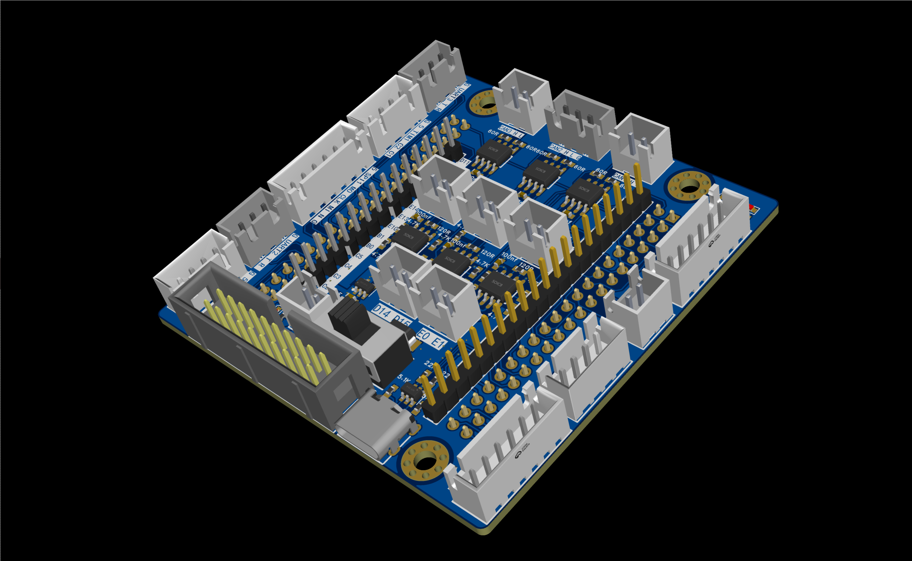
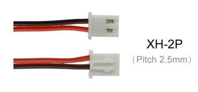
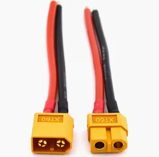
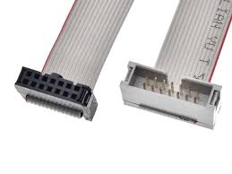
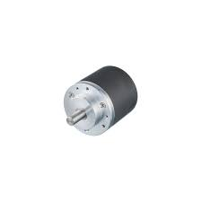
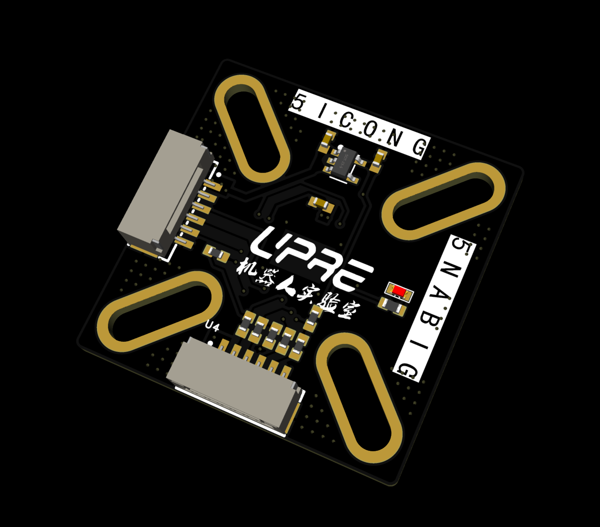
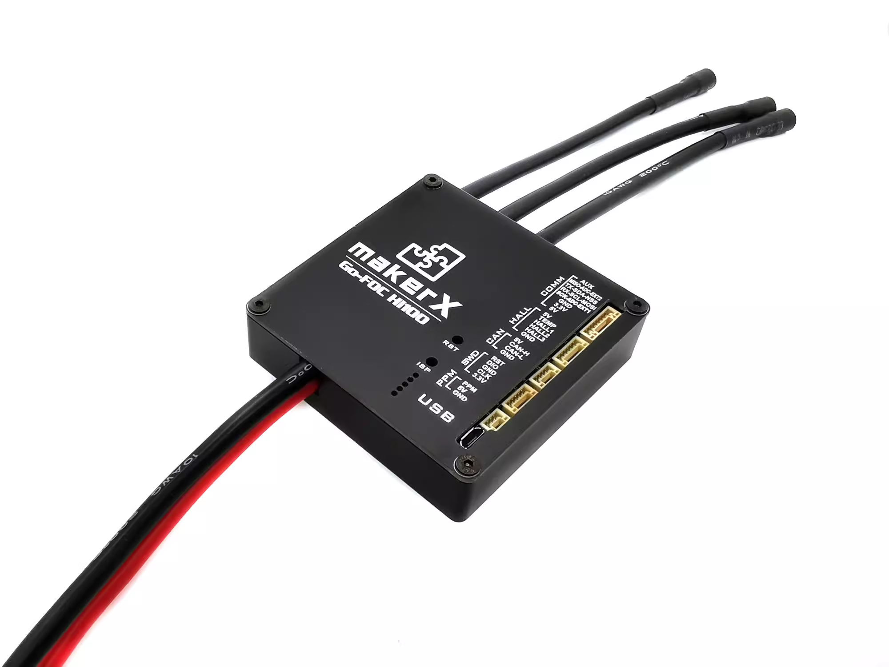
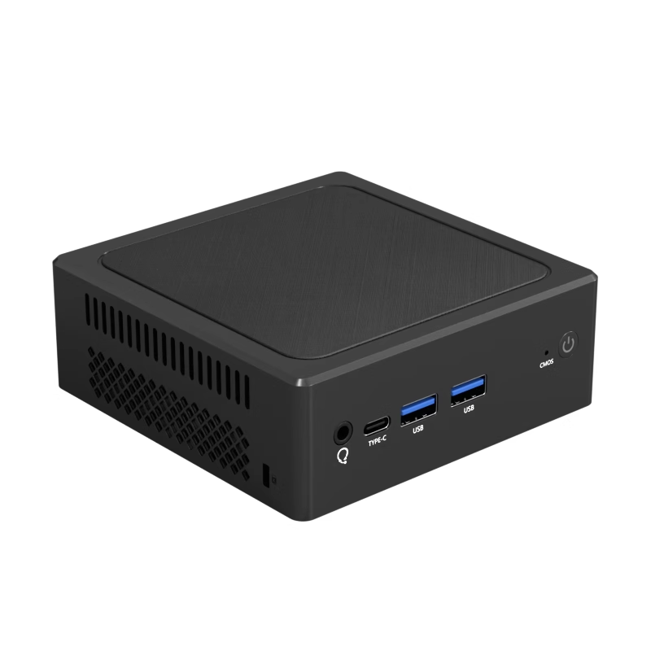
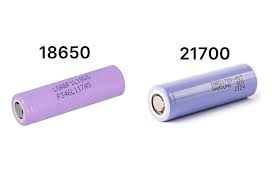

# 机械电控联合培训
前言：除了电控组，机械组也要知道这些基础知识，因为某些装置的原理作用注意点对机械组的设计和装配也会有影响  
## 主控板
  
机器人的核心，所有程序在里面运行，通过它协调控制传感器和气缸电机等部件
## 接头
1.XH2.54   
  
2.GH1.25  
  
3.XT60\XT30  
  
4.MR60\MR30  
  
5.牛角座和排线  
  
## 编码器
### 分类1
1.相对式编码器  
原理：脉冲计数  
特点：每次上电角度都从零开始，掉电丢失  
2.单圈绝对式编码器  
特点：每次上电读取的角度是绝对式的，掉电不丢失  
3.多圈绝对式编码器  
原理：特殊光栅编码  
特点：体积大，安装不方便，支持转速低，价格昂贵  
  
### 分类2
1.光电式编码器  
原理：光栅计数  
优点：精准不飘值  
缺点：价格贵,体积大,安装不方便  
  
2.磁编码器   
原理：检测磁场   
优点：价格便宜，安装方便  
缺点：电机端需要加磁铁  
注：磁铁需要买径向磁铁  
实验室常用型号: AS5047P  
  
## 电机  
注意：电机使用中要注意电流和电压限制，关注其温度防止过热烧电机
1.三相航模无刷电机  
优点：可选型号宽，种类型号多，功率上限高，价格相对便宜  
缺点：需要搭配电机驱动板和外接编码器  
注意：电机三相线的顺序只决定电机转的方向，可软件调整，无需在意；电机装车前一定要刷好参数保存，不然要拆了重新装，编码器刷好后不要修改编码器和电机定子的相对位置，不要修改磁铁和电机转子的相对位置  
参数：电机的扭矩和电流有关，转速和电压有关；电机的KV值代表每升高1V电压提升的转速；电机最好不要过流，过流也不要超过10%；  
电机在过流到一定程度时会出现磁饱和效应，扭矩达到上限，再增大电流对其提升微弱；电机内部有电感，电流突变时（突然启动，急加减速或者急刹车）会产生反向电压，非电池供电时可能会损坏，电池供电时反向电压会使电压升高  
对电压有要求的场景需要考虑电机的反向电压  
一些方波控制的无刷电机不能带载启动，一些内阻比较大的电机不能使用  
电机在速度非常低时很难低速启动，电机极对数越大可以转的最低速度就越大  
2.关节电机  
优点：内置编码器，使用简单，位控更精准  
缺点：种类型号少，价格昂贵  
3.舵机  
优点：便宜小巧  
缺点：一般都是pwm控制，不支持组网，一个舵机陪三根线，接线困难；转速慢，相应慢；不支持360°多圈旋转；不能返回数据，不支持闭环控制  
## 电机驱动板
  
原理：逆变器  
实验室常用的电机驱动板是VESC，常用的店家是创客基地，翻天科技和永刚驱动主店。
创客基地最便宜，但是几乎没有售后，出了问题无人解答，客服不理人，而且很难用，维修要花很多钱；永刚驱动主店的价格最贵，但是维修只收原料费和快递费，服务态度好，耐心解答问题  
电机驱动板主要是用来驱动无刷航模电机，需要接三相线和编码器，然后通过CAN总线和主控板通信；电机驱动板购买考虑的主要参数是最大电流和电压
## 迷你主机
  
算力比主控强大的多, 用来解析摄像头和雷达的数据, 以及跑AI模型  
## 传感器
1.DT35  
原理：激光测距  
优点：精准，采样频率高  
缺点：距离只支持八米，需要有墙做定位，对墙的高度有要求，对水平装配和场地的平整度有要求，不能被挡住  
2.陀螺仪  
原理：加速度累计  
优点：精度高（相对于3D雷达），应用场景不可替代  
缺点：贵  
注意：会受振动影响，装配要在下面垫海绵  
3.3D雷达  
原理：  
优点：某些场景无法替代，机器人离地不受影响  
缺点：需要小电脑，耗电，反馈频率低，非常贵，有时候需要摆车架确认初始位置  
4.码盘  
原理：正交轮子，通过光栅编码器读累计值计算xy坐标    
优点：精度高，反馈速率高   
缺点：机器人离地后需要重新校准；必须位于底盘上，占用位置大；在无其他校准方式前必须摆车确认初始位置    
5.相机  
优点：能AI识别物体，颜色，测距，功能多  
缺点：算力要求高，需要小电脑，反馈频率是最低的，相机越多频率越低  
注意；一辆车上最好不要有太多相机（反面教材24年车5个相机） 
6.色标传感器  
优点：识别颜色，速度远大于相机  
缺点；实验室没有使用经验  
7.光电开关，限位开关，光电门  
光电开关和光电门检测光线有没有被挡住，限位开关检测它有没有被撞到，可以用来检测物体位置  
## 布线
无论是信号线还是电源线对线电阻都有要求  
电源线要承受大电流，需要根据电流范围选择合适粗细的电源线  
信号线要进行阻抗匹配，而且信号线电压低（一般3.3~5V），太长的信号线会导致能量衰减通信出现错误  
之前出现过并联三个spi线未做阻抗匹配无法通信，CAN线需要60~120Ω电阻，需要时刻维持  
线路焊接触电电阻会大，发热会加剧，还有有信号反射，而且焊接处强度会降低容易断，一根线上通常不要超过两个焊点  
信号线之间也会有电磁干扰  
高中物理：变换的电流会产生变换的磁场，变换的磁场会产生变换的电流，信号线通常都是快速传递信息的，对于一些高频线（如相机上的USB 3.2）就会对临近的信号线产生干扰，这时需要加屏蔽胶带处理  
信号线绕线也会有类似干扰，所以布线禁止绕线，长度不合适就拆了重焊，不要嫌麻烦，CAN和485需要双绞线  
## 电池
  
  
电池的放电倍率（C）*电池容量（A·h）= 电池最大瞬时电流（A）  
电池瞬间放电会导致电压下降，对电压有要求的场景慎用（电机占空比模式）  
布线时注意计算线路中最大电流，保证电池能正常供电，否则会损坏电池  
24V电池电压使用中不要低于22.2V，12V电池使用中不要低于11.1V，建议24V就去充电  
注意：锂电池没有均衡板情况下不要并联；18650好21700之类的电池在测量尺寸时千万不要直接拿金属卡尺量，此电池正负极离得很近，测量时极易短路引起爆炸
## 无线通讯
无线通讯发送接收装置属于高频信号，应远离其它线路，应置于机器人外侧以免被机器人金属外壳电磁屏蔽；蓝牙WIFI抗干扰能力弱，比赛场地通讯人数众多环境复杂，尽量不予使用；  
大功率无线通讯模块应考虑电源功率和质量的影响  

